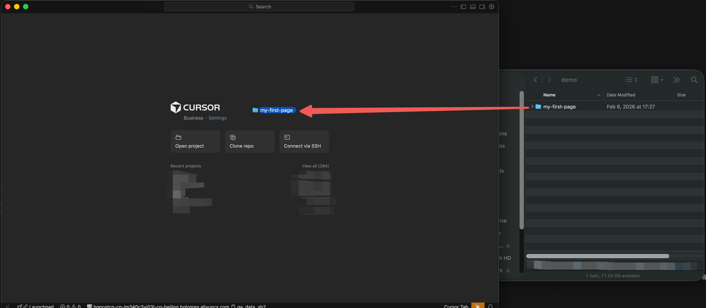
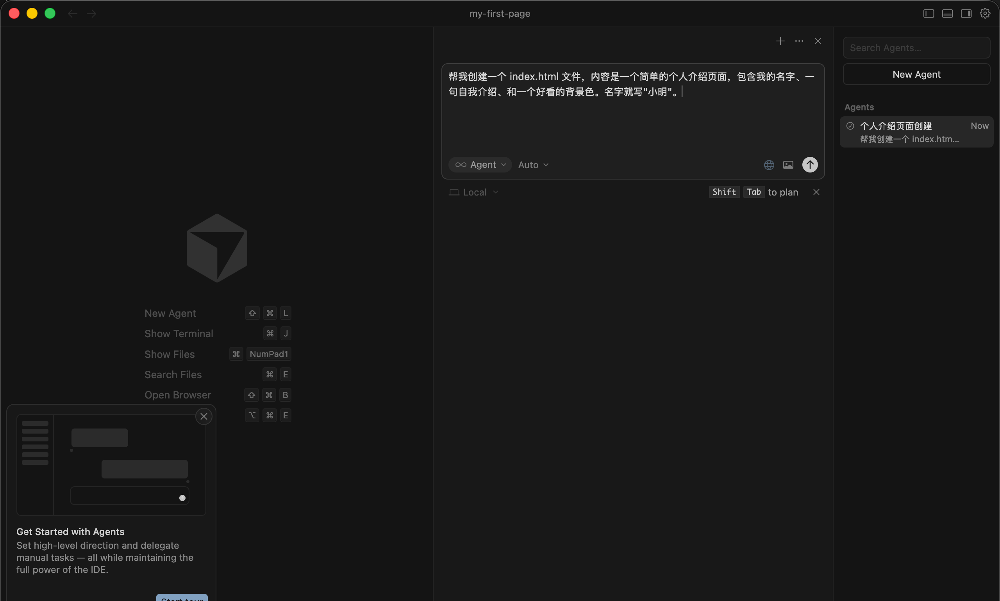
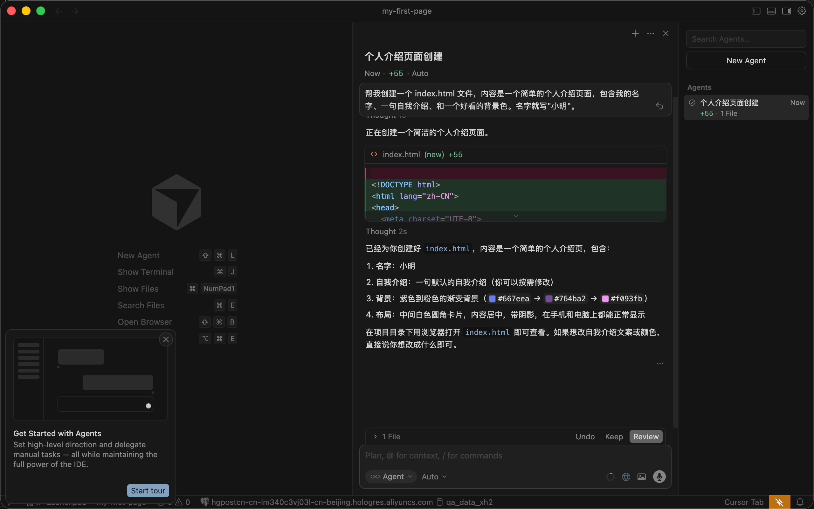
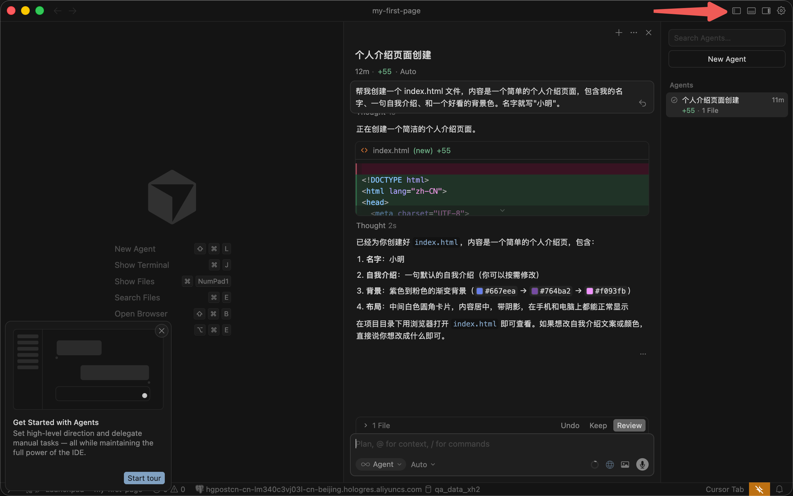
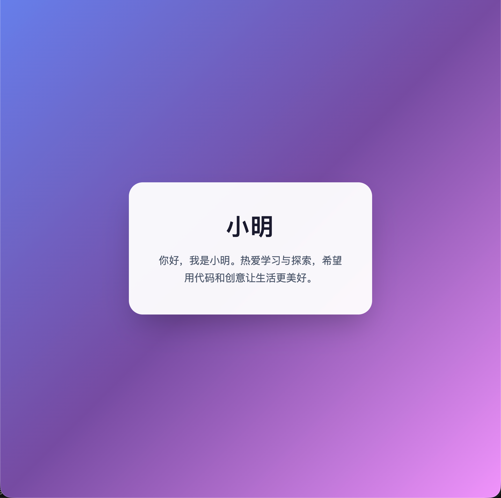
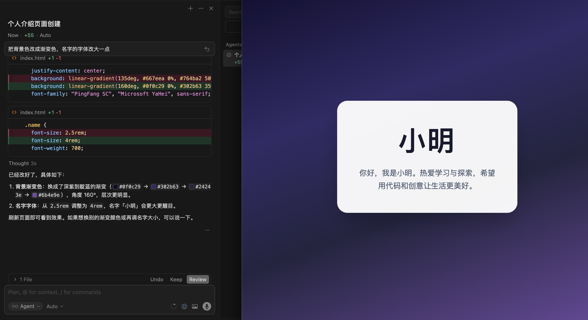

# 第一次和 AI 对话

## 本节目标

- 完成第一次 AI 对话
- 理解 Vibe Coding 的基本流程（说需求 → AI 生成 → 看结果 → 继续调整）
- 学会如何通过修改 Prompt 优化结果

## 热身练习

在正式开始项目之前，我们先做一个小练习：让 AI 帮你生成一个简单的网页。

这个练习的目的不是做出什么有用的东西，而是让你熟悉跟 AI 对话的感觉。

## 创建一个文件夹

首先，在你电脑上创建一个文件夹，用来放我们的练习文件。

1. 在桌面（或任何你喜欢的位置）新建一个文件夹，命名为 `my-first-page`
2. 打开 Cursor，把这个文件夹拖进 Cursor 窗口（或者用菜单 File → Open Folder）

## 跟 AI 说第一句话

按 `Cmd + I`（Mac）或 `Ctrl + I`（Windows）打开聊天面板，输入：

> 帮我创建一个 index.html 文件，内容是一个简单的个人介绍页面，包含我的名字、一句自我介绍、和一个好看的背景色。名字就写"小明"。

然后按回车发送。

## 看看 AI 做了什么

AI 会生成一个 `index.html` 文件。你会看到 Cursor 自动创建了这个文件，里面有一些代码。

**你不需要看懂这些代码。** 你只需要关注结果。

## 在浏览器中查看

找到左侧文件列表中的 `index.html`，右键点击它，选择"在文件管理器中显示"（Reveal in Finder / Explorer），然后双击用浏览器打开。

你应该能看到一个带有你名字和自我介绍的网页。

## 试试修改

现在试试跟 AI 说：(你可以尝试任何你想要修改的内容)

> 把背景色改成渐变色，名字的字体改大一点

看看 AI 会怎么做。

这就是 Vibe Coding 的基本流程：**说需求 → AI 生成 → 看结果 → 继续调整**。

## 不同的说法，不同的结果

试试用不同的方式描述同一个需求：

**简短版**：

> 做个个人介绍页面

**详细版**：

> 帮我创建一个 index.html 文件，做一个个人介绍页面。用现代简约风格，深色背景，白色文字，居中布局。名字用大号字体，下面放一句简短的自我介绍。

你会发现，**描述越具体，AI 做出来的东西越接近你的预期**。但也不需要每次都写很长——如果结果不满意，你随时可以让 AI 修改。

::: tip 核心要点
这是 Vibe Coding 最重要的认知：**你怎么说，决定了 AI 怎么做**。不需要第一次就说得完美，但越清楚的描述，越少的来回沟通。
:::

## 下一步

你已经完成了第一次 AI 对话，并且理解了 Vibe Coding 的基本流程。接下来我们进入第一个正式项目——番茄时钟。
