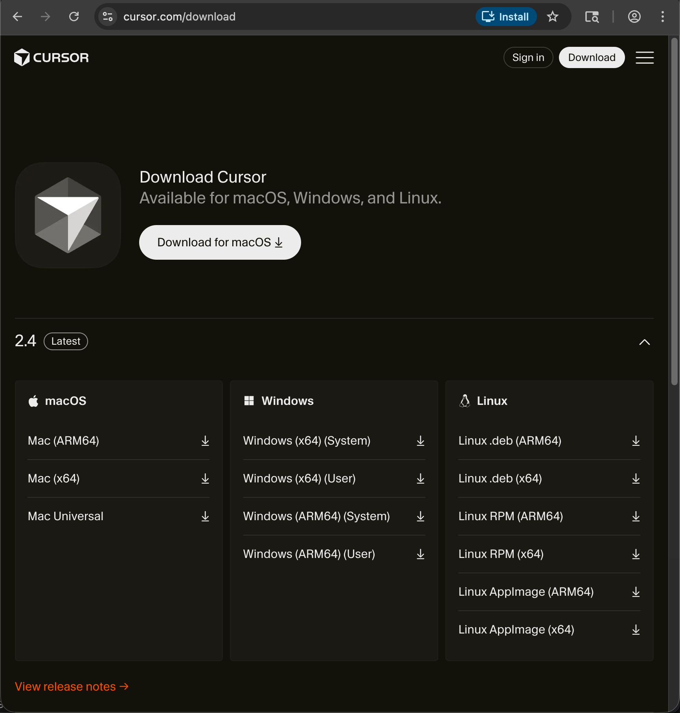
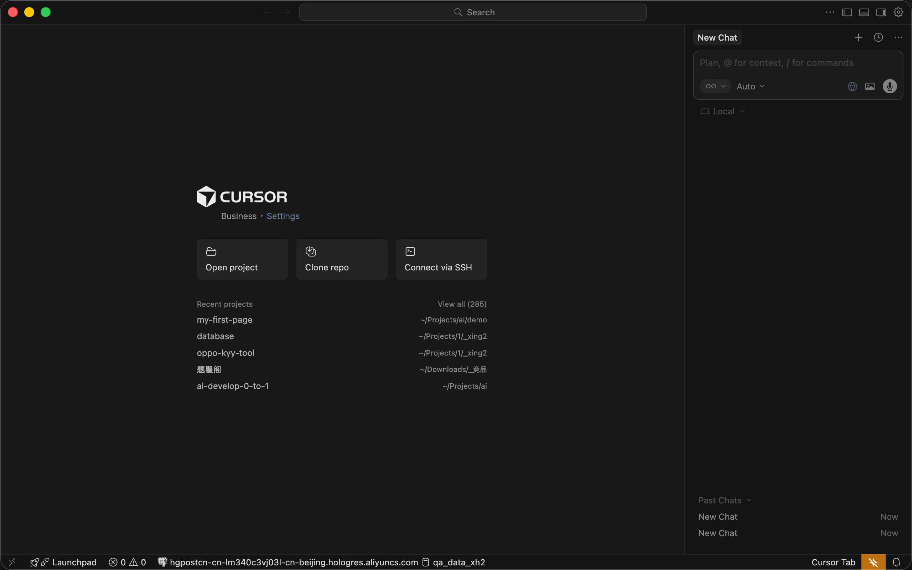

# 安装 Cursor 编辑器

## 本节目标

- 下载并安装 Cursor 编辑器
- 注册账号并登录
- 熟悉 Cursor 的基本界面和聊天面板

## 什么是 Cursor

Cursor 是一个内置 AI 的代码编辑器。你可以把它理解为一个"能跟 AI 聊天的记事本"——你在里面描述需求，AI 帮你生成代码，结果直接显示在编辑器里。

## 下载安装

### 第一步：打开 Cursor 官网

访问 [cursor.com/download](https://cursor.com/download)，点击页面上的下载按钮。

网站会自动识别你的操作系统（Windows / Mac），下载对应的安装包。

### 第二步：安装

**Mac 用户**：打开下载的 `.dmg` 文件，把 Cursor 拖到"应用程序"文件夹里。

**Windows 用户**：双击下载的 `.exe` 文件，按提示一路点"下一步"即可。

### 第三步：打开 Cursor

安装完成后，打开 Cursor。首次打开会引导你完成一些基本设置。
选择语言时，根据自己的喜好选择，我这里选择中文。这决定后续与AI对话时，AI的默认回复语言。不必担心，后续也可以在设置中修改。

### 第四步：登录账号

Cursor 需要登录才能使用 AI 功能。点击登录，可以注册或者使用已有的账号登录。

## 认识 Cursor 的界面

登录后你会看到 Cursor 的主界面。现在你只需要认识一个地方：

**聊天面板**——这是你跟 AI 对话的地方。

打开方式：按快捷键 `Cmd + I`（Mac）或 `Ctrl + I`（Windows）。

你会看到一个输入框，跟平时用 ChatGPT 一样，在这里输入你的需求就行。

## 下一步

Cursor 已经准备好了。下一节我们来试试跟 AI 说第一句话。
