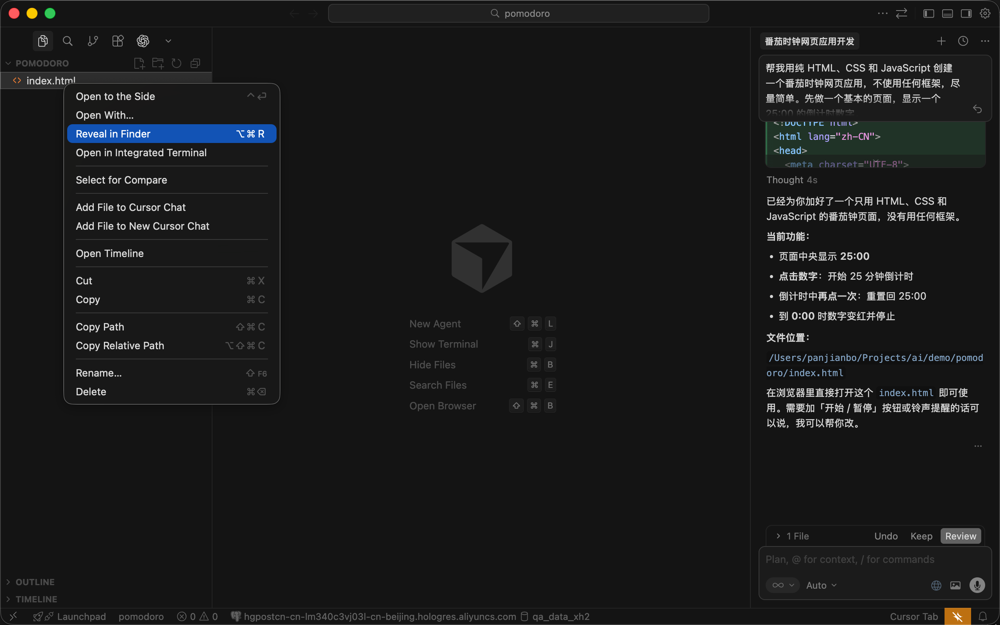

# 创建项目

## 本节目标

从零开始，让 AI 帮你创建一个番茄时钟的网页应用，并在浏览器中看到它运行。

## 创建项目文件夹

在你的电脑上新建一个文件夹，命名为 `pomodoro`（番茄时钟的英文），然后用 Cursor 打开它。

1. 在桌面（或你喜欢的位置）新建文件夹 `pomodoro`
2. 打开 Cursor，菜单选择 File → Open Folder，选中 `pomodoro` 文件夹

## 告诉 AI 你要做什么

按 `Cmd + I`（Mac）或 `Ctrl + I`（Windows）打开聊天面板，输入：

> 帮我用纯 HTML、CSS 和 JavaScript 创建一个番茄时钟网页应用，不使用任何框架，尽量简单。先做一个基本的页面，显示一个 25:00 的倒计时数字。

按回车发送。

## AI 做了什么

AI 会创建一个 `index.html` 文件（可能还会有 `style.css` 和 `script.js`，也可能把所有内容写在一个 HTML 文件里——两种情况都正常）。

你会在 Cursor 左侧的文件列表中看到新创建的文件。

点击"Accept"按钮接受 AI 的更改。

## 在浏览器中打开

找到 `index.html` 文件，右键点击，选择"在文件管理器中显示"，然后双击用浏览器打开。

你应该能看到一个页面，上面显示着 **25:00**。

虽然现在它还不能计时，但这已经是你的第一个番茄时钟了！

::: tip 如果页面显示不正常
如果打开后是空白页面或者显示混乱，不要慌。回到 Cursor，在聊天面板中告诉 AI：

> 页面打开后显示不正常，请检查一下代码有没有问题

AI 会帮你排查并修复。
:::

## 提示词对比

上面我们用了一个比较具体的 prompt。如果你说得更模糊，会怎样？

**试试这样说**：
> 做个番茄时钟

AI 可能会问你：
> "你想用什么技术来实现？React、Vue 还是纯 HTML/CSS/JS？"

作为零基础学员，你可能看不懂这些选项。没关系，你可以回复：

> 我是零基础，请帮我选择最简单的方案

AI 就会帮你做出选择，继续工作。最终结果是一样的，只是多了一轮对话。

**要点**：prompt 越具体，AI 越不需要追问。但就算说得模糊，AI 也会引导你把事情做好。

## 下一步

现在页面上的 25:00 还是静止的。下一节我们让它动起来——实现真正的倒计时。
