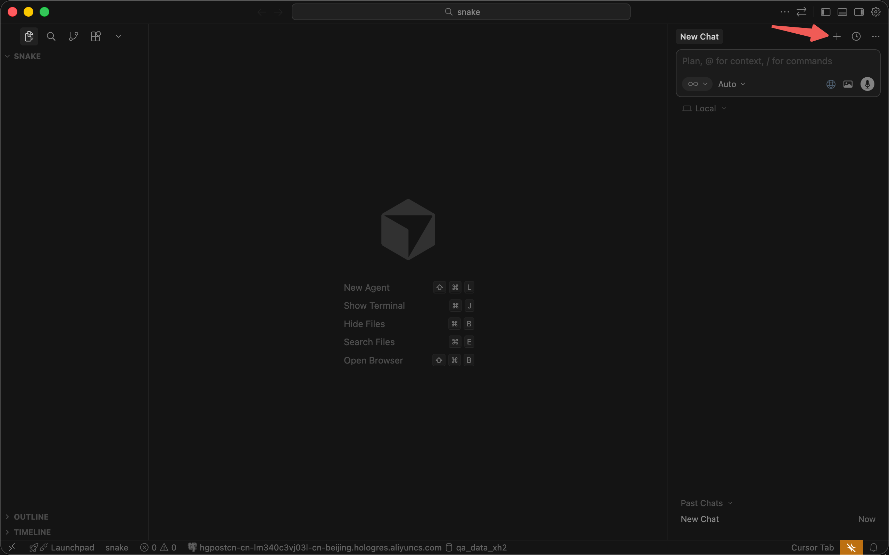

# 环境升级

## 本节目标

安装 Node.js 开发环境，学会用 AI 创建一个有构建工具的项目。这是从"纯 HTML 文件"到"工程化项目"的第一步。

## 向 AI 咨询技术方案

在番茄时钟项目中，我们只用了一个 HTML 文件，浏览器直接打开就能跑。但如果项目变复杂了呢？作为非开发者，你可能不知道该用什么工具——**这恰恰是 AI 能帮你的地方**。

新建一个文件夹 `snake-game`，用 Cursor 打开。在聊天面板中输入：

> 我想做一个贪吃蛇网页游戏，代码会比较多，不想像之前那样把所有东西塞进一个 HTML 文件里。有没有什么更好的方式来组织项目？

AI 会告诉你：可以使用**构建工具**（比如 Vite）来组织项目，而 Vite 需要先安装 **Node.js** 环境。

::: tip 这就是 Vibe Coding 的思维方式

你不需要提前知道"开发一个网页游戏应该用什么技术栈"。你只要向 AI 描述你的需求和痛点，AI 就会推荐合适的工具。

以后遇到类似的问题——"我想做 XX，该用什么工具？"——都可以先问 AI。

:::

## 安装 Node.js

根据 AI 的建议，我们需要先安装 Node.js。它是构建工具 Vite 运行所需要的环境。

::: tip 让AI帮你安装

推荐你直接让AI帮你安装，具体操作见[使用AI帮助安装](#使用AI帮助安装)

:::

### 使用AI帮助安装

在Cursor的聊天面板中输入：

> 帮我安装Node.js

AI 会在 Cursor 的终端中运行检查命令，并告诉你结果。

### 传统安装方式

1. 访问 [nodejs.org](https://nodejs.org)
2. 根据官网的提示安装Node.js


安装完成后，让 AI 帮你确认安装是否成功。在 Cursor 的聊天面板中输入：

> 帮我检查一下 Node.js 是否安装成功

## 开始做贪吃蛇

::: tip

如果你在上一步使用AI安装的Node.js，那么最好先新建一个AI对话，这样做的目的是可以让AI对话的上下文更干净。这个概念我们后续会重点讲解。



:::

在聊天面板中输入：

> 帮我用 Vite 创建一个纯 JavaScript 项目，我们要做一个贪吃蛇游戏。请帮我初始化项目并确保能运行起来。

AI 会帮你做以下几件事：

1. 初始化项目结构
2. 安装依赖（你会在终端中看到一些安装过程）
3. 启动开发服务器

## 新的运行方式

项目创建完成后，AI 会启动一个开发服务器。你会在终端中看到类似这样的信息：

```
Local: http://localhost:5173/
```

在浏览器中打开这个地址，你就能看到页面了。

::: tip 和番茄时钟的区别

- 番茄时钟：双击 `index.html` 打开
- 贪吃蛇：在终端运行命令，然后通过 `http://localhost:5173` 打开

看起来多了一步，但好处是——你修改代码后，页面会**自动刷新**，不用手动按 F5。
:::

## 常见问题

### 终端中显示 `npm: command not found`

Node.js 可能没有安装成功。告诉 AI：

> 终端中运行 npm 命令提示 command not found，请帮我排查

### 安装依赖时报错

告诉 AI：

> 运行 npm install 时报错了，错误信息是：[把你看到的错误复制粘贴过来]

把错误信息复制给 AI，AI 就能帮你解决。

## 下一步

环境已经准备好了。下一节我们开始做贪吃蛇游戏的核心玩法。
